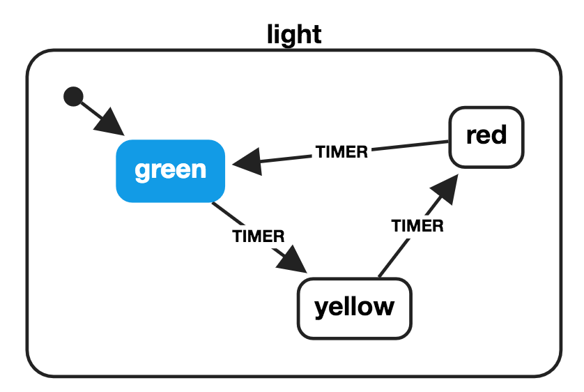

---
# You can also start simply with 'default'
theme: default
# some information about your slides (markdown enabled)
title: Welcome to Slidev
info: hello
# apply unocss classes to the current slide
class: text-center
# https://sli.dev/features/drawing
drawings:
  persist: false
# slide transition: https://sli.dev/guide/animations.html#slide-transitions
transition: fade
# enable MDC Syntax: https://sli.dev/features/mdc
mdc: true
---

# XState Introduction
Presentation slides for developers

---

# What is XState?

XState 是一個用於狀態管理的 JS 函式庫

利用有限狀態機（FSM）和狀態圖（Statecharts）

來描述與管理應用中的各種狀態與轉換

使邏輯更加明確且易於維護

---

# Finite State Machine（還要改）

有限狀態機是一種數學模型用來描述系統的行為

- State
- Action

去定義清楚下面四類的 Action：

- 進入動作：在進入狀態時進行
- 退出動作：在退出狀態時進行
- 輸入動作：依賴於目前狀態和輸入條件進行
- 轉移動作：在進行特定轉移時進行



---

# Demo

````md magic-move {lines: true}
```ts
const toggleMachine = createMachine({
  id: 'toggle',
  initial: 'Inactive',
  states: {
    Inactive: {
      on: { toggle: 'Active' },
    },
    Active: {
      on: { toggle: 'Inactive' },
    },
  },
});
```

```ts
// Create an actor that you can send events to.
// Note: the actor is not started yet!
const actor = createActor(toggleMachine);

// Subscribe to snapshots (emitted state changes) from the actor
actor.subscribe((snapshot) => {
  console.log('Value:', snapshot.value);
});

// Start the actor
actor.start(); // logs 'Inactive'

// Send events
actor.send({ type: 'toggle' }); // logs 'Active'
actor.send({ type: 'toggle' }); // logs 'Inactive'
```

```ts
import { useMachine } from '@xstate/react';
import { toggleMachine } from './toggleMachine';

const App = () => {
  const [state, send] = useMachine(toggleMachine);

  return (
    <div>
      <div>Value: {state.value}</div>
      <button onClick={() => send({ type: 'toggle' })}>Toggle</button>
    </div>
  );
};
```

```ts {*|3|12-14}
const toggleMachine = createMachine({
  id: 'toggle',
  context: { count: 0 },
  initial: 'Inactive',
  states: {
    Inactive: {
      on: { 
        toggle: 'Active' 
      },
    },
    Active: {
      entry: assign({
        count: ({ context }) => context.count + 1,
      }),
      on: { toggle: 'Inactive' },
    },
  },
});
```

```ts {*|3-6|12}
const toggleMachine = createMachine({
  id: 'toggle',
  context: ({ input }) => ({
    count: 0,
    maxCount: input.maxCount,
  }),
  initial: 'Inactive',
  states: {
    Inactive: {
      on: {
        toggle: {
          guard: ({ context }) => context.count < context.maxCount,
          target: 'Active',
        },
      },
    },
    Active: {
      entry: assign({
        count: ({ context }) => context.count + 1,
      }),
      on: { toggle: 'Inactive' },
    },
  },
});
```
````

---

# State Chart

[連結](https://stately.ai/registry/editor/embed/05bdef56-870a-4edf-9800-5c2351ce7232?machineId=295d6e4b-384c-43a7-9b5a-55edc15d5b91&mode=Simulate)

---

# Extensions

[連結](https://marketplace.visualstudio.com/items?itemName=statelyai.stately-vscode)

---

# Todos

1. 未來可在重要的 xxx ，嘗試
2. 與 Jotai 的[結合](https://jotai.org/docs/extensions/xstate)
