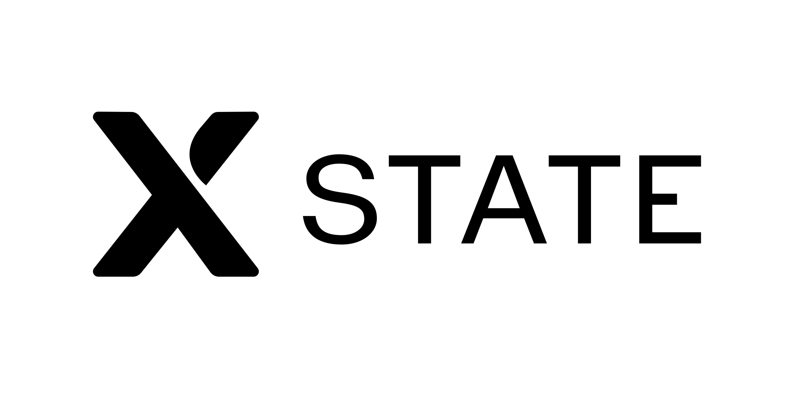

---
# You can also start simply with 'default'
theme: default
# some information about your slides (markdown enabled)
title: XState Introduction - Terry Lin
# apply unocss classes to the current slide
class: text-center
# https://sli.dev/features/drawing
drawings:
  persist: false
# slide transition: https://sli.dev/guide/animations.html#slide-transitions
transition: fade
# enable MDC Syntax: https://sli.dev/features/mdc
mdc: true
---

# 像 MAGIC 一樣厲害的 XState
Terry Lin @MediaTek

---

# What is XState?

XState 是一個用於狀態管理的 JS 函式庫

利用有限狀態機（FSM）和狀態圖（Statecharts）

來描述與管理應用中的各種狀態與轉換，使邏輯更加明確且易於維護

- 可視化工具
- 框架無關性
- 強大的擴充性

能讓開發者更輕鬆地追蹤狀態轉變的過程

還可降低程式<span v-mark.orange="1">因條件混亂或多層 if-else 判斷</span>導致的錯誤



---

# Finite State Machine

有限狀態機（FSM），是一種用來描述系統行為的數學模型

- 有限狀態：系統的所有可能狀態是有限且固定的，每次系統<span v-mark.orange="1">僅能處於其中一個狀態</span>
- 狀態轉換：根據外部輸入或事件，系統會從當前狀態轉換到另一個狀態
- 輸入條件：轉換的觸發條件通常由外部輸入決定，不同的輸入對應不同的轉換路徑
- 動作或輸出：在狀態轉換過程中，系統可能會執行特定動作或產生相應輸出


---

# Quick Start

````md magic-move {lines: true}
```ts
const toggleMachine = createMachine({
  id: 'toggle',
  initial: 'Inactive',
  states: {
    Inactive: {
      on: { toggle: 'Active' },
    },
    Active: {
      on: { toggle: 'Inactive' },
    },
  },
});
```

```ts
// An actor is a running process that can receive messages (events),
// send messages and change its behavior based on the messages it receives.

// Create an actor that you can send events to.
// Note: the actor is not started yet!
const actor = createActor(toggleMachine);

// Subscribe to snapshots (emitted state changes) from the actor
actor.subscribe((snapshot) => {
  console.log('Value:', snapshot.value);
});

// Start the actor
actor.start(); // logs 'Inactive'

// Send events
actor.send({ type: 'toggle' }); // logs 'Active'
actor.send({ type: 'toggle' }); // logs 'Inactive'
```

```tsx
import { useMachine } from '@xstate/react';
import { toggleMachine } from './toggleMachine';

const App = () => {
  const [state, send] = useMachine(toggleMachine);

  return (
    <div>
      <div>Value: {state.value}</div>
      <button onClick={() => send({ type: 'toggle' })}>Toggle</button>
    </div>
  );
};
```

```ts {*|3|12-14}
const toggleMachine = createMachine({
  id: 'toggle',
  context: { count: 0 },
  initial: 'Inactive',
  states: {
    Inactive: {
      on: { 
        toggle: 'Active' 
      },
    },
    Active: {
      entry: assign({
        count: ({ context }) => context.count + 1,
      }),
      on: { toggle: 'Inactive' },
    },
  },
});
```

```ts {*|3-6|12}
const toggleMachine = createMachine({
  id: 'toggle',
  context: ({ input }) => ({
    count: 0,
    maxCount: input.maxCount,
  }),
  initial: 'Inactive',
  states: {
    Inactive: {
      on: {
        toggle: {
          guard: ({ context }) => context.count < context.maxCount,
          target: 'Active',
        },
      },
    },
    Active: {
      entry: assign({
        count: ({ context }) => context.count + 1,
      }),
      on: { toggle: 'Inactive' },
    },
  },
});
```
````

---

# State Chart Demo

以 Codebase 中出現的主要狀態做範例：

1. home
2. directChat
3. assistantChat
4. tmaChat

要 Simulate 請到 [Stately Editor](https://stately.ai/registry/editor/b3e81f94-5eaf-4235-96b9-b436adafecc8?mode=Design&machineId=a6ae1d42-68f3-4e84-b4c3-382f249904bb) 

或者用 [VSCode Extension](https://marketplace.visualstudio.com/items?itemName=statelyai.stately-vscode)


---

# Todos

1. 深入探索 XState 更多功能，參考[官方文件](https://stately.ai/docs)
2. 若要與 Jotai 的整合，可用 [jotai-xstate](https://jotai.org/docs/extensions/xstate)
3. 可以在適合的場景中進行小規模嘗試
   - [XState](https://stately.ai/docs/xstate)：
     - 適用於狀態邏輯<span v-mark.orange="1">較複雜、流程繁多且需要嚴謹控制</span>的情況
     - 因其能夠明確定義各狀態、事件與轉換，並可視覺化追蹤整個狀態流程
   - [Jotai](https://jotai.org/)：
     - 適用於狀態邏輯<span v-mark.orange="1">較簡單或需要細粒度、局部管理</span>的場景
     - 其極簡的 API 設計只會更新實際依賴該 atom 的元件，從而提升效能
